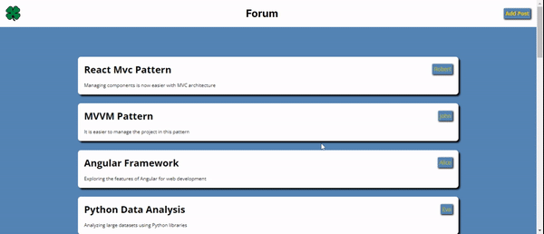

# react-mvc-forumapp

# MVC (Model View Controller)

- Model: The data logic of the application | represents the data structure.
- View: Represents the User Interface.
- Controller: Communicates between Model and View.
- To lay the foundation for using Model View Controllers in our React apps(https://legacy.reactjs.org/blog/2013/06/05/why-react.html)

# Libraries

- axios
- react-router-dom
- json-server (fake database)
- sass

# Things done during the project phase.

- Retrieved Api blog data from `Controller`
- Card printed on the screen for each blog data `View`

- Created a form interface `View`
- Keep the states of the inputs in the form when they change `Controller`
- State values to be kept have been determined `Model`
- When sent, send the post to the API and redirect the user to the 'Controller'

